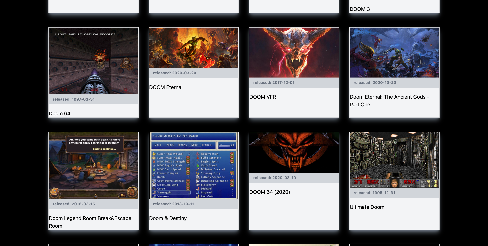
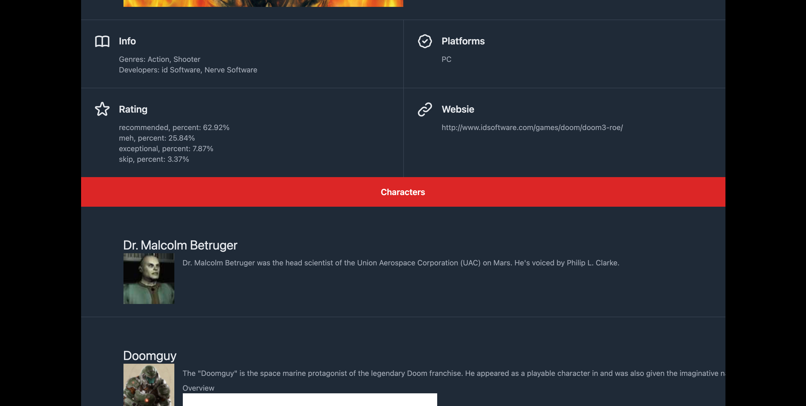
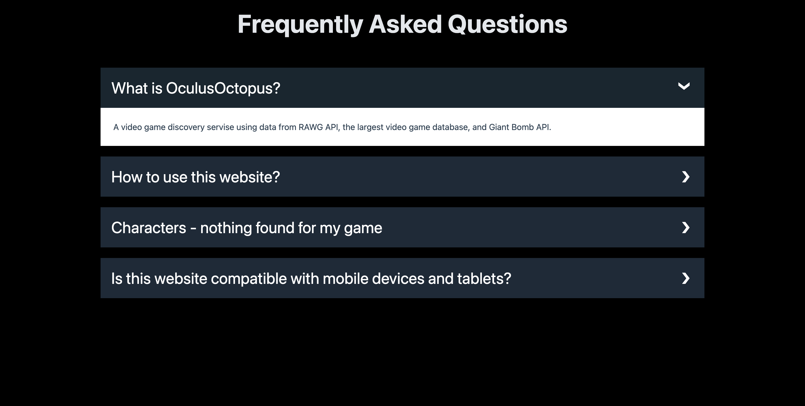

# Oculus Octopus

A video game discovery servise using data from RAWG API, the largest video game database, and  Giant Bomb API

## Technologies Used

* HTML
* CSS (Tailwind)
* JavaScript (jQuery)

## Description 

Use this app to get information about a video game; more than 350,000 games are available. Search for a game and you will be presented with a set of game cards that matches your search input. Choose the card you like best and get info about that video game. Game info contains a game image, description, developers and genre, platforms, rating, and game website. Additionally to that, you may be presented with game characters, just click on "characters" button at the bottom of the game info section. Give the page time to load data and then the screen will be scrolled down to new info. 

## Usage 
​
To search for a game, input a game name and click "Search". Then, click on a game card you like to see datailed informatoin. To see characters click "characters" button in the game info section. Use search history at the top left of the page to read about that game again.
## Page View

| |   |
| :---:   | :-: | 
| |  | 
## Link

Link to deployed application https://mcarieri.github.io/oculus-octopus/

---
MIT License
Copyright (c) [2021] [we]
